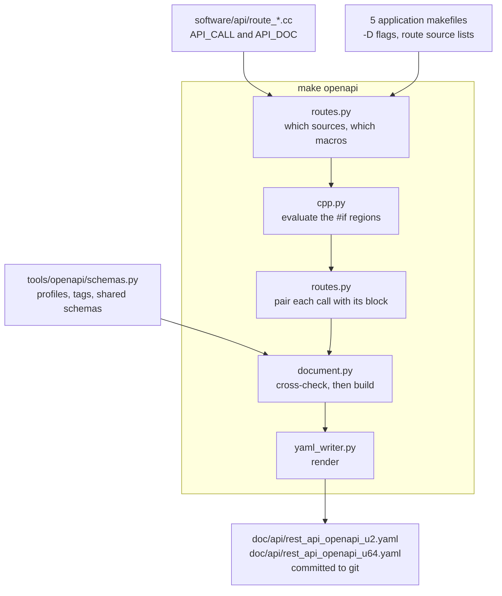
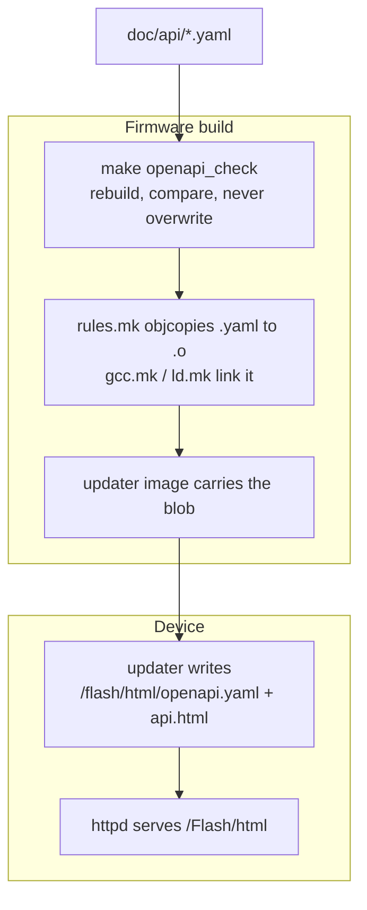
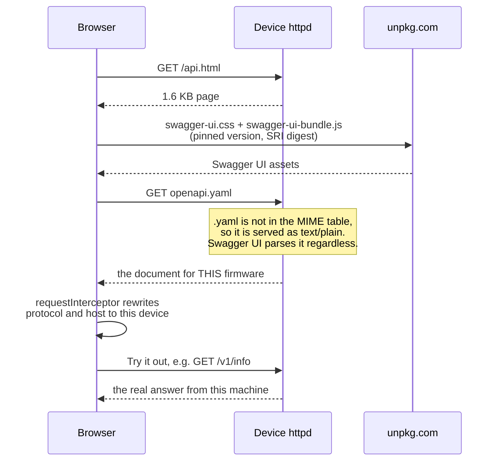

# How the OpenAPI documents are generated

The REST API is described by two OpenAPI 3.1 documents, one per product family,
both committed under `doc/api/`. Neither is written by hand: `make openapi`
derives them from the firmware sources, and a firmware build fails if the
committed files no longer match those sources.

| | |
| --- | --- |
| Source of truth | `software/api/route_*.cc`, `software/api/routes.cc` |
| Generator | `tools/openapi/generate.py`, standard library Python only |
| Output | `doc/api/rest_api_openapi_u2.yaml`, `doc/api/rest_api_openapi_u64.yaml` |
| Gate | `make openapi_check`, a prerequisite of every firmware target |
| On the device | `GET /openapi.yaml`, `GET /api.html` |

Which calls a product serves is decided when the firmware is compiled, not at run
time, so one document cannot describe both families:

| document | products | paths | operations | size |
| --- | --- | --- | --- | --- |
| `rest_api_openapi_u2.yaml` | Ultimate II, II+, II+L | 44 | 55 | 129,837 B |
| `rest_api_openapi_u64.yaml` | Ultimate 64, 64 Elite, 64 Elite II | 47 | 59 | 140,423 B |

The Ultimate 64 document is larger because `route_streams.cc` is compiled only by
its makefiles, and because `machine:debugreg` sits behind `#if U64`.

## Two macros side by side

`API_CALL`, defined in `software/api/routes.h`, already carries the verb, route,
command, body handler and query parameters. What a route registration cannot know
- the prose, the path template, the response shapes - goes in an `API_DOC` block
directly above it:

```cpp
API_DOC(GET, machine, readmem,
    TAG("Machine")
    SUMMARY("Read C64 memory")
    DESCRIPTION("Performs a DMA read on the cartridge bus and returns the "
                "bytes as a binary attachment. The read may not pass $FFFF.")
    PATH("/v1/machine:readmem", "readMemory", "")
    PARAM("address", "string", "Start address in hexadecimal, 0000 to FFFF.", "", "D020")
    PARAM("length", "integer(1..65536)", "Number of bytes to read.", "256", "2")
    RESPONSE("200", "application/octet-stream", "", "The bytes read.", "")
    RESPONSE_ERROR("400", "Invalid address", "")
)
API_CALL(GET, machine, readmem, NULL, ARRAY( { {"address", P_REQUIRED},
                                               {"length", P_OPTIONAL} }))
```

The verb, route and command repeat in both, and that triple is the key the
generator pairs them on.

`software/api/api_doc.h` contains one definition and nothing else:

```cpp
#define API_DOC(...)
```

Because the macro's parameters do not appear in its replacement list, the
preprocessor never expands what is inside the invocation either. `TAG`, `SUMMARY`
and the rest therefore need no definitions and cannot collide with anything else
in the tree, while the compiler still checks the block is balanced with
terminated string literals. The only change to the compiled firmware in this
whole feature is one `#include` line in `routes.h`.

Everything that is not about a single call - the product profiles, the document
prose, the tag list, the security scheme, the shared schemas - lives in
`tools/openapi/schemas.py`.

## The pipeline



From the committed documents to the device:



Where each piece runs:

| stage | what happens |
| --- | --- |
| Author, by hand | `make openapi` rewrites both documents. No device, no cross toolchain, no packages, a few hundred milliseconds. |
| Every firmware target | `openapi_check` runs first, so a local `make u64` fails exactly the way CI does. |
| CI, before the builds | `make openapi_test` then `make openapi_check` in the build image. |
| CI, next step | `openapi-spec-validator` in a stock `python:3.12-slim` image. |
| CI, after the builds | both documents uploaded as the `openapi_<version>` artifact. |
| Link time | the committed `.yaml` becomes a `.rodata` blob in the updater image. Nothing parses it. |
| Device, on update | the updater writes the blob to the flash disk next to `index.html`. |
| Device, on request | httpd serves it as a static file. |

`openapi_check` is a prerequisite of `u2_rv`, `u2_rv_swonly`, `u2plus`,
`u2plus_swonly`, `u64`, `u64_no_esp`, `u64ii`, `u64ii_no_esp`, `u2pl`,
`u2pl_no_esp` and `u2pl_swonly`. It rebuilds both documents in memory and
compares the rendered bytes, then reports the stale one and stops. It never
regenerates: a build step that quietly rewrote the file would hide the author's
omission instead of reporting it.

The validation step runs outside the build image because that image has neither
`pip` nor `ensurepip` and cannot install a host package at all. Both it and
`make openapi_validate` take their file list from
`tools/openapi/generate.py paths`, and `tools/openapi/test_ci.py` parses the
workflow and the root `Makefile` to fail the build if the two stop using the same
validator, the same strictness flag or that same path source.

## Why the generator reads makefiles

This is the part that is easy to miss. Neither macro says which product serves a
call. Two things decide that, and both are read out of the tree rather than
restated in a table:

- **Which route sources a product compiles.** `routes.target_sources()` matches
  each candidate file name against the makefile text. `route_streams.cc` appears
  only in the Ultimate 64 makefiles, so the cartridge document has no
  `/v1/streams` paths at all.
- **Which macros they are compiled with.** `routes.target_defines()` scrapes the
  `-D` flags; `cpp.active_lines()` evaluates the `#if` regions with those values.

The five makefiles read are named in `schemas.PROFILES`:

| profile | application makefile | relevant defines |
| --- | --- | --- |
| `u2` | `target/u2/riscv/ultimate/Makefile` | `-DU2 -DRISCV` |
| | `target/u2plus/nios/ultimate/Makefile` | `-DU2 -DNIOS=1` |
| | `target/u2plus_L/riscv/ultimate/Makefile` | `-DU2 -DRISCV -DUSB2503` |
| `u64` | `target/u64/nios2/ultimate/Makefile` | `-DU64=1 -DNIOS=1` |
| | `target/u64ii/riscv/ultimate/Makefile` | `-DU64=2 -DU2 -DRISCV` |

These five are inputs and are not modified by this feature. Note that the
Ultimate 64 II defines both `U2` and `U64=2`; `#if U64` is what separates the
families.

Two rules keep this safe. Every target in a family must compile the same set of
route sources, and must produce an identical documented call table, compared by a
fingerprint of every call and every directive. A product drifting away from its
family is a build failure, not a document that is quietly wrong for one of them.

`software/api/route_input.cc` shows why `#if` evaluation is needed at all:
`GET` and `POST /v1/machine:input` each carry two `API_DOC` blocks, one in the
`#if U64` arm and one in the `#else` arm, above a single `API_CALL`. On the
cartridges those calls can only refuse - the firmware answers 501 with a reason -
and the `#else` block describes them as refusals with no success response.

## Inside the generator

| module | responsibility |
| --- | --- |
| `generate.py` | Command line: `generate`, `check`, `paths`. Writes the header and the file. |
| `routes.py` | Reads the makefiles and the route sources; produces the paired call table for one profile. |
| `cpp.py` | Just enough C++: comment stripping, `#if` evaluation, macro invocation scanning, C string literal decoding. |
| `document.py` | Turns one paired table into the OpenAPI object. Owns every cross-check between the two halves. |
| `schemas.py` | Profiles, prose, tags, security scheme, shared schemas and responses, the caution vocabulary. |
| `yaml_writer.py` | Deterministic block-style YAML, so generation needs nothing installed. |
| `explorer.py` | What `html/api.html` may load, and from where. |
| `fixture.py` | A miniature repository the parser and document tests run against. |

### What it refuses

Each of these stops the build, and each has a unit test under `tools/openapi/`.

*Pairing* - a call with no block, or a block with no call; the same
verb/route/command declared twice on either side.

*Parameters and body* - a parameter only one half knows about; a duplicate
`PARAM`, `PATH_PARAM`, `PARAM_ENUM` or `PATH_PARAM_ENUM` name; a `BODY` where the
call has no body handler, or a body handler with no `BODY`; two `BODY` directives
for one content type.

*Paths* - a template that does not start with `/v1/<route>` or end with
`:<command>`; an unexpected segment between the two; a `{placeholder}` with no
`PATH_PARAM`, or a `PATH_PARAM` no `PATH` uses; the same verb on one template
twice; an `operationId` used twice.

*Responses* - no `RESPONSE` applying to an operation; two `RESPONSE` directives
for one status code in one scope; two `RESPONSE_EXAMPLE` directives with one name
for one code; a `RESPONSE_EXAMPLE` for a code that has no response with content;
any of the three scoped to an `operationId` the call does not have.

*Values and vocabulary* - an example or default that is not a literal of its
declared type; a `RESPONSE_EXAMPLE` payload that is not valid JSON; a `CAUTION`
hint outside the closed set; a `TAG` not in `schemas.TAGS`; a `$ref` to a schema
`schemas.py` does not define, or a schema it defines that no product refers to;
more than one `CAUTION` or `DEPRECATED` in a block; an unknown directive or a
wrong argument count.

*Cross-target* - two targets of one family compiling different route sources, or
producing different call tables.

*Staleness* - the committed documents differing from what the sources say.

### What it adds by itself

Three things follow from how the firmware dispatches, so they are added to every
operation rather than repeated in every block: the shared `Forbidden` response,
because the network password is checked before dispatch; a 412 example on any
call with a body handler, because the firmware refuses a POST whose body never
arrived; and `security: [{}, {NetworkPassword: []}]` at document level, the empty
requirement first because a device with no password accepts every request without
one.

### Calls that need care

Nothing is hidden. Every registration appears in the document for the product
that serves it, and the generator fails the build if one is missing - an omitted
call would only make an agent guess. Three kinds are marked instead:

- `GET /v1/help` is registered and was never implemented. `DEPRECATED` says so,
  and Swagger UI renders it struck through.
- `debugreg`, `measure` and `heap` share the `Diagnostics` tag, described as
  hardware debugging rather than as a way to drive the machine.
- A call with consequences beyond returning an answer carries `CAUTION`. One
  directive produces both renderings so they cannot disagree: prose appended to
  the description for a person reading Swagger UI, and an `x-ultimate-caution`
  field for an agent to gate on. The hint vocabulary is closed - `destructive`,
  `machine-state`, `persistent`, `power`, `diagnostic`, `idempotent` - and is
  explained inside the document itself, so a consumer does not need this file.

## Getting the document into the image

The build had no way to link a `.yaml`. Adding a class of embedded blob takes
three shared files, because each keeps its own list:

| file | what it adds |
| --- | --- |
| `target/common/rules.mk` | `OBJS_YAML` from `SRCS_YAML`, a `%.o: %.yaml` objcopy rule, `OBJS_YAML` in `ALL_OBJS` |
| `target/common/gcc.mk` | `$(OBJS_YAML)` in the prerequisite list of the `.out` link rule |
| `target/common/ld.mk` | the same, for targets linked with `ld` rather than `gcc` |

`ALL_OBJS` is only what the recipe hands the linker. The prerequisite lists in
`gcc.mk` and `ld.mk` are written out separately, so adding the class to
`ALL_OBJS` alone would link the object but not relink when the document changes.

The objcopy rule renames the symbols objcopy would otherwise derive from the full
path, so `rest_api_openapi_u64.yaml` becomes `_rest_api_openapi_u64_yaml_start`
and `_end` - exactly what the updater sources declare `extern`.

Seven leaf makefiles then name the document their image carries, three lines
each:

```make
VPATH     += $(PATH_SW)/../doc/api
SRCS_HTML  = index.html api.html
SRCS_YAML  = rest_api_openapi_u64.yaml    # or _u2
```

| makefile | image | document |
| --- | --- | --- |
| `target/u2/riscv/updater/Makefile` | `update.u2r` | u2 |
| `target/u2/microblaze/mb_update_to_rv/Makefile` | MicroBlaze to RISC-V migration updater | u2 |
| `target/u2plus/nios/updater/Makefile` | `update.u2p` | u2 |
| `target/u2plus_L/riscv/updater/Makefile` | `update.u2l` | u2 |
| `target/u64/nios2/updater/Makefile` | `update.u64` | u64 |
| `target/u64ii/riscv/update/Makefile` | `update.ue2`, `update.cfw` | u64 |
| `target/pc/linux/makefat/Makefile` | host tool that builds the U64 II FAT flash-disk image | u64 |

`makefat` takes a fourth line, because it is a PC-host tool with its own link
rule rather than one from `gcc.mk` or `ld.mk`. It compiles
`software/application/u64ii_prepare_fat/flash_disk_prep.cc` on the build host,
which writes the same two files into `/prep/html`. It is not invoked by any
target in the root `Makefile`, so it is not covered by the `openapi_check` gate.

`tools/openapi/test_packaging.py` holds the two halves together. The makefile
picks the *file*, the updater source picks the *symbol*, and a symbol only
resolves to the file the makefile embedded. It globs `target/**/Makefile` for
`SRCS_YAML` and checks that the embedded document is one the generator writes,
that a source compiled by that target refers to it, that the symbol and the file
agree, that the target also ships `api.html`, and that no application source
refers to a document no target embeds. Without that, a copy-paste in a leaf
makefile would ship the Ultimate II contract on an Ultimate 64.

The document adds about 126 KB to the Ultimate II updater images and 137 KB to
the Ultimate 64 ones, including the 2 KB explorer page. The runtime application
is unaffected, and the `app_space` gate measures that image, not the updater.

## On the device

`write_api_files()` in `software/application/update_u2p/update_common.h` writes
`api.html` and `openapi.yaml` into `/flash/html`. The httpd static file
middleware already serves that directory - `STATIC_FILE_FOLDER "/Flash/html"` in
`software/httpd/c-version/lib/middleware.h`, the case difference being irrelevant
on FAT - so httpd itself is unchanged.



The page fetches Swagger UI from `unpkg.com` rather than carrying it: the bundle
is about 1.7 MB and the smallest product has under 900 KB of flash disk in total.
With no route to the internet the page shows a notice linking to the raw
document.

Because a script from another origin runs with the page's privileges, three
things bound it. The version in the URL is exact, so it names one immutable
release. Each file carries an `integrity` digest, so a substituted file is
refused by the browser. And the page's Content-Security-Policy allows scripts
from nowhere but that pinned origin plus its own inline script, admitted by
`sha256-` digest rather than `'unsafe-inline'` - with `connect-src 'self'`, which
is what stops anything the page loads from sending the device's answers, or a
password typed into Try it out, anywhere else. `validatorUrl: null` suppresses
Swagger UI's badge, which would otherwise send the device's address to
`validator.swagger.io`.

`tools/openapi/explorer.py` records the pinned version and both digests;
`test_explorer.py` fails the build if the page stops agreeing with it or drops
any of those directives.

## Testing

| layer | what it establishes | needs |
| --- | --- | --- |
| `make openapi_test` | the generator itself: C++ reading, `#if` evaluation, pairing, every refusal above, the YAML writer, the shape of the real documents, the packaging and CI wiring, the explorer page | nothing |
| `make openapi_check` | the committed documents match the sources | nothing |
| `make openapi_validate` | the documents are valid OpenAPI 3.1 | `openapi-spec-validator` |
| `./run-tests -s openapi-validator` | the response validator's own verdicts, pinned against hand-written answers | `PyYAML`, `openapi-schema-validator` |
| `./run-tests -s openapi-contract` | the device answers as its document says, and a real code generator produces a working client from it | a device, plus `openapi-python-client` |

`tests/lib/openapi_contract.py` checks each answer against the document: that the
status code is declared for that operation, and that a JSON body validates
against the declared schema. It is installed in `tests/lib/rest.py`, the only
HTTP client the suites use, so

```
./run-tests -H u64 --validate-openapi
```

applies it to every existing suite without a suite being changed. It is off by
default and travels to the child processes through
`ULTIMATE_VALIDATE_OPENAPI`. Which document applies is decided from
`core_version` in the device's own `GET /v1/info` answer - the same `#ifdef U64`
switch that decides the call set - or stated directly with
`ULTIMATE_OPENAPI_PROFILE`. The check costs 0.08 to 0.13 ms per response once the
validators are cached.

## Extending it

**Add or change a call.** Edit the `API_CALL` and the `API_DOC` block above it,
run `make openapi`, and commit the code and both regenerated documents together.
If the halves disagree the generator names the file and line and writes nothing.

**Add a shared response schema.** Define it in `schemas.SCHEMAS` and name it from
a `RESPONSE`. A schema no product refers to fails the build, so remove it when
the last reference goes.

**Add a tag.** Add it to `schemas.TAGS`. A tag appears in a document only if an
operation there uses it, in the order that list gives.

**Add a caution hint.** Add it to `schemas.CAUTION_HINTS` with a one-line
meaning. The document's own explanation is generated from the hints in use, so it
stays in step.

**Add a product or target.** Add its application makefile to the right entry in
`schemas.PROFILES`, or add a new profile if it belongs to neither family - a new
document then appears automatically, and `generate.py paths` lists it, which is
what CI and `make openapi_validate` iterate over. Then add `SRCS_YAML` and
`api.html` to whatever builds its updater image, and an `extern` plus a
`write_api_files()` call to the updater source. `test_packaging.py` fails until
both halves agree.

**Move to a newer Swagger UI.** Change `VERSION` and both digests in
`tools/openapi/explorer.py`, and the same version and digests in `html/api.html`
(URL, `integrity`, and the two CSP origins). The digests are what
`openssl dgst -sha384 -binary | openssl base64 -A` prints for the file at the
pinned URL. `test_explorer.py` fails until page and module agree.

## Limitations

- **A JTAG application load does not update the document.** `/Flash/html` is
  written by the updater, so a device whose application alone was replaced keeps
  the document from whichever release last ran the updater. The
  `openapi-contract` suite reports that as a warning naming the cause, not a
  failure.
- **`GET /openapi.yaml` is served as `text/plain`**, because `.yaml` is not in
  the httpd MIME table. Swagger UI parses it regardless.
- **The document describes calls, not sequences.** It says nothing about ordering
  constraints such as pausing the machine before a large read.
- **Three cartridge calls can only refuse.** `GET` and `POST /v1/machine:input`
  and `PUT /v1/machine:poweroff` are registered on the Ultimate II family and
  answer 501 with a reason, which is more use to a client than a 404. Spectral's
  `operation-success-response` rule warns about exactly those three; that is the
  firmware's shape being reported, not a defect in the document.
- **The `#if` evaluator supports a subset of the grammar**: `defined`, integer
  literals, identifiers, `!`, unary `-`, `+ - < > <= >= == != && ||` and
  parentheses. Anything else raises rather than guessing. It also evaluates
  conditions inside regions the real preprocessor would skip, so an unsupported
  expression nested inside a `#if 0` would fail the build.
- **`routes.target_sources()` matches bare file names.** The convention here is
  `VPATH` plus bare names in `SRCS_CC`, and the match deliberately refuses a name
  preceded by `/` or `.` so a `VPATH` directory entry is not mistaken for a
  source. A makefile listing a route source with a directory prefix would not be
  seen as compiling it.

## Verifying this document

Every claim above can be checked from a clean checkout, without a device.

```bash
make openapi_test                       # OK, 191 tests
make openapi_check                      # openapi: 2 documents match the sources
python3 tools/openapi/generate.py paths # the two file names, one per line

# API_DOC reaches neither the preprocessor output nor the image
printf '#define API_DOC(...)\nAPI_DOC(GET, x, y, DESCRIPTION("MARKER"))\nint f(void){return 1;}\n' > /tmp/t.cc
g++ -E /tmp/t.cc | grep -c MARKER                       # 0
g++ -c -Wall -Wextra -pedantic /tmp/t.cc -o /dev/null   # clean

# The staleness gate fires
sed -i 's/Read C64 memory/Read C64 memoryX/' doc/api/rest_api_openapi_u64.yaml
make openapi_check                      # fails, names rest_api_openapi_u64.yaml
git checkout -- doc/api/rest_api_openapi_u64.yaml

# The consistency gate fires: add an undocumented parameter to any API_CALL,
# then `make openapi_check` reports, for example:
#   openapi: software/api/route_machine.cc:331: documents parameters
#   ['address', 'length'] but ...:350 registers ['address', 'bogus', 'length']

# Which makefiles the generator reads, and what it takes from them
python3 - <<'PY'
import pathlib, sys
sys.path.insert(0, "tools/openapi")
import routes, schemas
for name, profile in sorted(schemas.PROFILES.items()):
    print(name, routes.compiled_sources(profile, "."))
    for target in profile["targets"]:
        print("   ", target, routes.target_defines(pathlib.Path(target).read_text()))
PY

# Which makefiles embed which document
grep -rn "SRCS_YAML" target/ --include=Makefile
```
