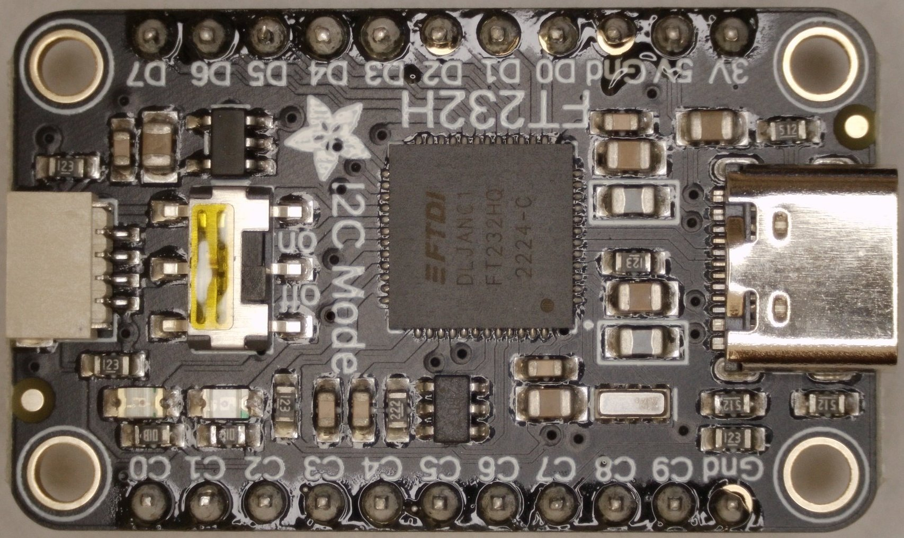
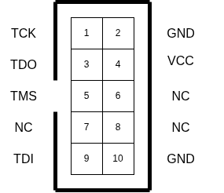
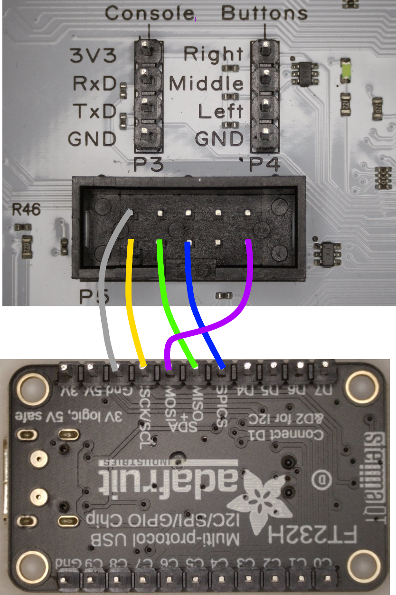

# Reviving a Ultimate Elite II / Commodore C64 Ultimate board

The following instructions show the necessary steps to revive a bricked Ultimate Elite II (U64ii) or a Commodore C64 Ultimate (C64U). Other boards are not supported by this method or may require different firmware.

In this context, a bricked board means that incorrect or faulty firmware has been flashed onto the board. The board is either partially bricked (the FPGA starts, but the soft core RISC CPU crashes, e.g., the screen remains black) or completely bricked (no signs of life after powering on).

## Preparation
The following hardware and software are required:

### Hardware needed

* PC / Laptop with Linux, Mac or Windows OS
* FT232H-based USB JTAG programmer, e.g., Adafruit FT232H board
* 5 female-to-female jumper wires
* Philips PH2 screwdriver to open the C64
* Soldering iron for the JTAG pin headers



### Software needed


## script based Software Installation

The Software can be installed with a install script

### Linux
1. open terminal.
2. run `./install.sh`
3. attach USB JTAG device

### Windows
1. run `install.bat` 
2. attach USB JTAG device
3. Download [Zadig](https://zadig.akeo.ie/) and change driver for FT232H to `libusb-win32`

### macOS
1. Install libusb with Homebrew: `brew install libusb`
2. execute `./install.sh`

## manual Software Installation 

A second way to install the needed Software can be done manually

### Linux

1. Open a terminal
2. set up a virtual Python environment `python -m venv ./myenv`
3. start the virtual environment `. myenv/bin/activate'
4. install the needed libraries `pip install -r requirements.txt`
5. using udev rules to detect the FTDI adapter and give access to the user:

```
sudo cp ./99-ft232h.rules /etc/udev/rules.d/
sudo udevadm control --reload-rules
sudo udevadm trigger
sudo usermod -a -G plugdev $USER
```

### Windows

1. Open a cmd window
2. Create a virtual Python environment `python -m venv .venv`
3. start the virtual environment `call .venv\Scripts\activate`
4. install the needed libraries `pip install -r requirements.txt`
5. attach USB JTAG device
6. Download [Zadig](https://zadig.akeo.ie/) and change driver for FT232H to `libusb-win32`


### macOS

1. Install libusb with Homebrew: `brew install libusb`
1. Open a terminal
2. set up a virtual Python environment `python -m venv ./myenv`
3. start the virtual environment `. myenv/bin/activate'
4. install the needed libraries `pip install -r requirements.txt`


## Hardware Installation

The hardware requires some preparation and careful wiring. Errors can damage the board.

### JTAG USB board

A word of warning: Stay away from cheap Chinese FT232H boards. Buy an Adafruit board instead. 

The USB JTAG adapter comes with pin headers that must be soldered on.

The connection between the USB JTAG adapter and the 64U board is made via the JTAG port P5 using 5 jumper wires. The 3.3V pins should only be connected, when you programmer has an target voltage detection input. The Adafruit FT232 programmer does not have this input.




| USB JTAG | Label | 64U P5 Pin |
|----------|-------------|-------------|
| AD0 | TCK | 1 |
| AD1 | TDI | 9 |
| AD2 | TDO | 3 |
| AD3 | TMS | 5 |
| GND | GND | 2/10 |



### Connecting to the U64 Board

Before connecting the jumper cables to the U64 board:

* Disconnect the board from power. Unplug the U64 power supply connector!. Keep in mind: Parts of the board will always under power, when the power supply connector is inserted (for example the ESP32 Wifi chip).
* Connect the jumper cables for JTAG and doublecheck the wiring.
* Connect the JTAG USB Programmer to a free USB ports on the PC.
* Connect the U64 power supply connector.
* Turn on the U64 board. Briefly move the rocker switch upwards. It should power up the C64U. The JTAG board will be powered via USB

## Start Recovery Script

Use the starter script for your platform:
- **Linux/macOS:** `./run.sh`
- **Windows:** `run.bat`

The recover.py script is used to load the FPGA bitcode and the Ultimate Application into DRAM. The flash memory is not modified. After a power cycle, the board woud just restart with the program from the FLASH memory. 

### Final steps

The 64U board should start now and display the Commodore BASIC start screen. 
* Open the Ultimate menu 
* Start the Disk File Browser. 
* Select the proper 'update.ue2' file from the USB stick
* Start the System update by selecting 'Run Update'
